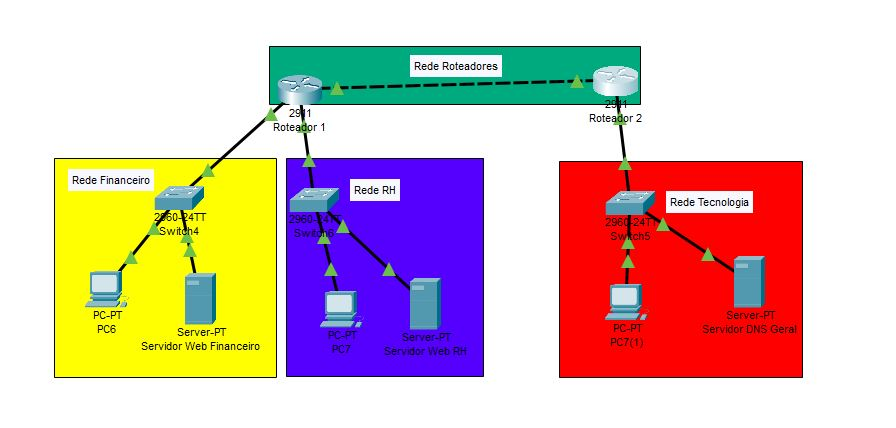

# ada-curso-redes-desafio-final
Repositório destinado ao projeto final do curso redes

# Objetivo Final:

Realizar a criação de 4 redes diferentes no Cisco Packet Tracer e realizar a comunicação entre elas. As redes devem seguir a orientação abaixo:

• Deve-se utilizar a rede **192.168.20.0** . Essa rede deve conter 4 subredes de tamanho igual que vão corresponder aos seguintes departamentos:

• **Rede Financeiro**:

- Criação de 4 computadores/notebooks dentro da Rede utilizando DHCP;
- O único servidor desta rede deve servir um site(financeiro.ada) HTTP com o conteúdo apresentando a palavra "Financeiro" e disponibilizar o serviço DHCP. Este servidor deve ter IP fixo;

• **Rede RH**:

- Criação de 3 computadores/notebooks dentro da Rede utilizando DHCP;
- Criação de 1 uma impressora utilizando IP fixo;
O único servidor desta rede deve servir um site(rh.ada) HTTP com o conteúdo apresentando a palavra "RH" e disponibilizar o serviço DHCP. Este servidor deve ter IP fixo;

• **Rede Tecnologia**:

- Criação de 1 computador dentro da rede utilizando IP fixo;
- Criação de 1 servidor DNS que resolverá os domínios das outras duas redes: Financeiro e RH; 

• **Rede Roteadores**:

- A função dessa rede é conectar os dois roteadores;
- Deve ser configurada uma rota estática entre os dois roteadores para permitir acesso as demais redes;

• **As redes devem ser distribuídas da seguinte forma**:
    
- Roteador 1:
    - Rede financeiro;
    - Rede RH;
    - Rede Roteadores
- Roteador 2:
    - Rede Tecnologia;
    - Rede Roteadores;

• **Equipamentos**:
    
- Utilizar os seguintes dispositivos Router 2911 e Switches 2960 24TT;

• **Explicação**:

- O objetivo final é que os dispositivos da Rede Financeira consigam se comunicar com os dispositivos da rede do RH e da Tecnologia.  Deve ser permitido que um dispositivo da rede Financeiro acesse o site da rede RH e vice versa. Lembrando que todos os DNS´s devem ser resolvidos pelo servidor DNS da tecnologia;
**Visão Final**:

